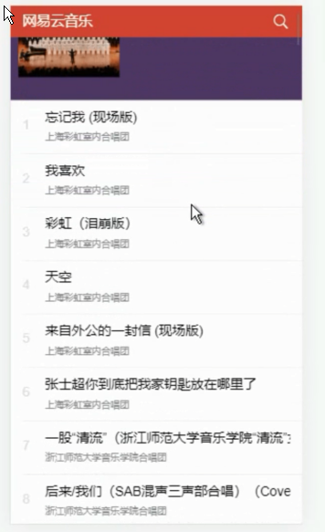

### MUSICPlayer
> 这是一个用 vuejs写的仿网易云的webapp
> 技术栈：vue vue-router vue-resource mint-ui

### test:

> APi接口来源于 `https://github.com/messoer/MessMusic` 接口文档说明 [查看](https://messoer.github.io/mess-api-doc/#/)

### js game
[贪吃蛇](https://yxrbws.github.io/game/Snake/snake.html)          
[烟花](https://yxrbws.github.io/game/Fireworks/index.html)          
[俄罗斯方块](https://yxrbws.github.io/game/Tetris/tetris.html)               
[2048](https://yxrbws.github.io/game/2048/index.html)         
[shoot](https://yxrbws.github.io/game/shoot/simple-shoot.html)
